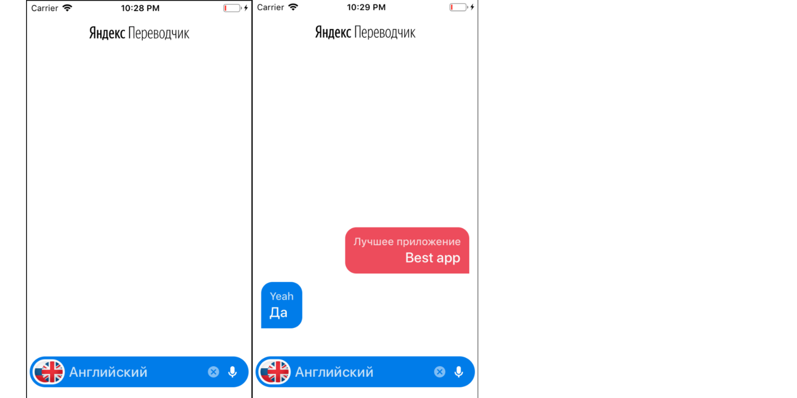

# Yandex-Translate
Приложение-переводчик подключенное к API Яндекса

## Что делает приложение:
* Переводит текст
* Автоопределяет язык текста
* RU / EN распознает голос
* Поддерживает ландшафтный режим  
  
  
  
Приложение представляет собой тестовое задание для работы в компании Яндекса. Работая над ним, я постарался реализовать архитектурный паттерн VIPER.

# Yandex-Translate
Application translator connected to Yandex API

## What an application can do:
* Text translation
* Auto-detect text language
* RU / EN voice recognition
* Landscape mode support   

The application is a test task for a job at a Yandex company. When working on it, I tried to implement the architectural pattern VIPER.
