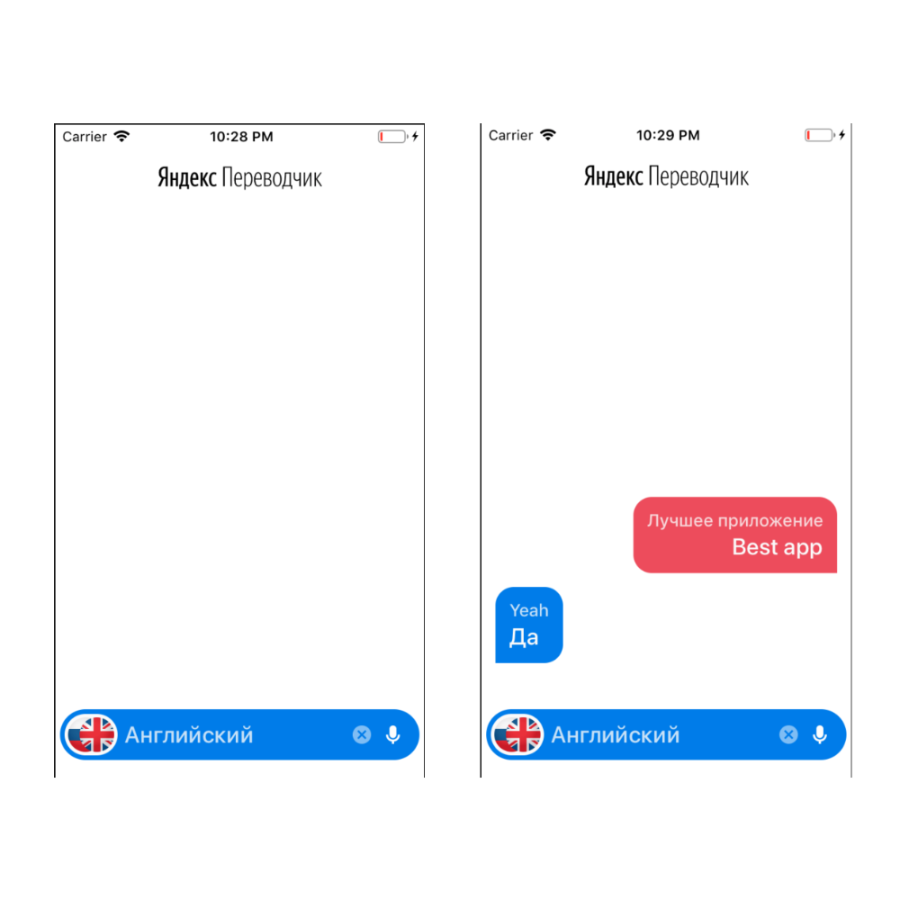

# Yandex-Translate
Application translator connected to Yandex API

## What an application can do:
* Text translation
* Auto-detect text language
* RU / EN voice recognition
* Landscape mode support

The application is a test task for a job at a Yandex company. When working on it, I tried to implement the architectural pattern VIPER.
